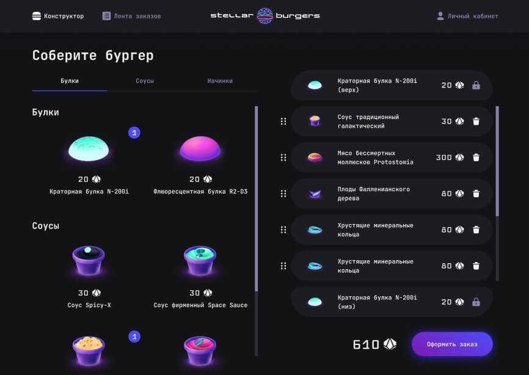

# Stellar-burger

Проект доступен по [**адресу**](https://kovolga.github.io/react-burger/).

## Стек технологий

## Главная страница

Возможности:

- Регистрация и авторизация
- Защита роутов
- Возможность оформить заказ на странице **Конструктора** (При клике на ингредиент открывается модальное окно с описанием конкретного ингредиента в компоненте IngredientDetails. При клике по кнопке «Оформить заказ» открывается модальное окно с описанием заказа в компоненте OrderDetails. Для рендера компонента модального окна используется React.createPortal)
- Просмотр всех заказов на странице **Лента заказов**
- Возможность редактирования личной информации в разделе **Личный кабинет**
- Возможность просмотра своих уже оформленных заказов и их статусов в **Личном кабинете** в разделе **История заказов**

Проект был выполнен в соответствии с предоставленным Яндекс Практикумом
[макетом](https://bit.ly/3IZ7rSr).
